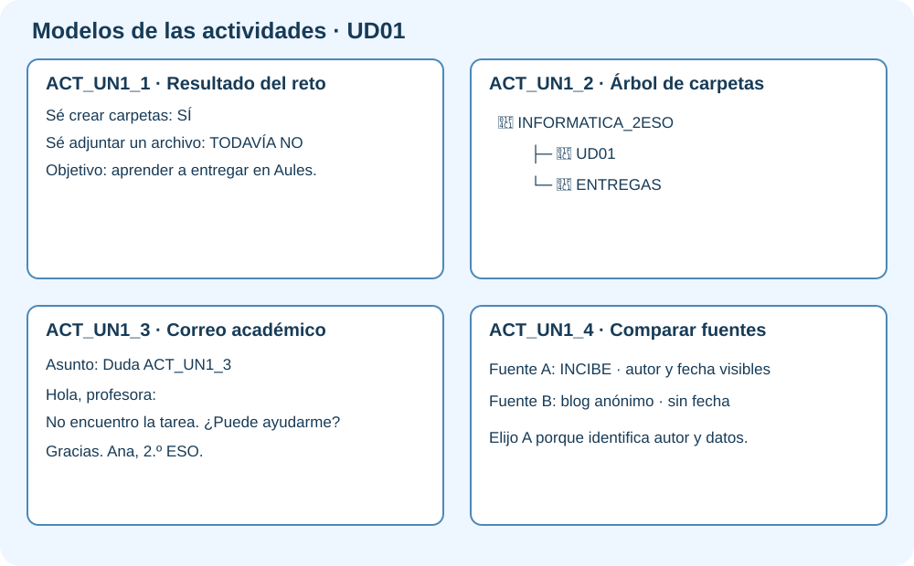

# Actividades · Introducción al uso del ordenador

Estas actividades preparan el primer proyecto: crear y mantener ordenada la carpeta de la **Feria Digital Responsable**.

Estas instrucciones están preparadas para quienes utilizan la herramienta por primera vez. Lee **un paso cada vez** y márcalo cuando lo termines.

| Código en Aules | Actividad |
|---|---|
| ACT_UN1_1 | Reto inicial sobre conocimientos de cursos anteriores |
| ACT_UN1_2 | Crear y ordenar el árbol de carpetas del curso |
| ACT_UN1_3 | Redactar y responder un correo académico |
| ACT_UN1_4 | Comparar dos fuentes sobre identidad digital |

## ACT_UN1_1 · Reto inicial sobre conocimientos de cursos anteriores

### ¿Qué vas a hacer?

Vas a descubrir qué recuerdas antes de empezar.

!!! example "Ejemplo de resultado"
    Documento con cinco respuestas y una marca final: **solo / con ayuda / todavía no**.

### Pasos

1. Abre un documento nuevo en Writer, Word o Documentos de Google.
2. Escribe el título `Así utilizo la tecnología`.
3. Escribe cinco frases: qué dispositivo utilizas, para qué lo utilizas, dónde guardas archivos, qué haces si olvidas una contraseña y cómo compruebas una noticia.
4. Debajo escribe `Lo he realizado:` y elige **solo**, **con un poco de ayuda** o **con mucha ayuda**.
5. Pon el título en negrita y revisa la ortografía.
6. Exporta el documento a PDF.
6. Guarda el resultado como `ACT_UN1_1_ApellidoNombre_v01`.
7. Entra en Aules, abre **ACT_UN1_1**, adjunta el archivo o enlace y pulsa **Enviar tarea**.

### ¿Qué debes entregar?

- El archivo o enlace creado.
- Una captura o frase que demuestre que lo has comprobado.
- Si utilizaste IA, indica para qué y cómo revisaste el resultado.

### Antes de enviar

- [ ] El nombre empieza por `ACT_UN1_1`.
- [ ] El archivo se abre o el enlace funciona.
- [ ] He realizado todos los pasos.
- [ ] Puedo explicar lo que he hecho.
- [ ] No aparecen datos personales.

## ACT_UN1_2 · Crear y ordenar el árbol de carpetas del curso

### ¿Qué vas a hacer?

Vas a aprender a guardar cada archivo en su lugar.

!!! example "Ejemplo de resultado"
    `INFORMATICA/UD01/ACTIVIDADES`, `RECURSOS` y `ENTREGAS`, visibles en una misma captura.

### Pasos

1. Abre tu carpeta personal.
2. Crea una carpeta llamada Informatica.
3. Dentro crea la carpeta de la unidad.
4. Crea dentro Actividades, Recursos y Entregas.
5. Haz una captura donde se vea el árbol completo.
6. Guarda el resultado como `ACT_UN1_2_ApellidoNombre_v01`.
7. Entra en Aules, abre **ACT_UN1_2**, adjunta el archivo o enlace y pulsa **Enviar tarea**.

### ¿Qué debes entregar?

- El archivo o enlace creado.
- Una captura o frase que demuestre que lo has comprobado.
- Si utilizaste IA, indica para qué y cómo revisaste el resultado.

### Antes de enviar

- [ ] El nombre empieza por `ACT_UN1_2`.
- [ ] El archivo se abre o el enlace funciona.
- [ ] He realizado todos los pasos.
- [ ] Puedo explicar lo que he hecho.
- [ ] No aparecen datos personales.

## ACT_UN1_3 · Redactar y responder un correo académico

### ¿Qué vas a hacer?

Vas a escribir un correo claro y respetuoso.

!!! example "Ejemplo de resultado"
    **Asunto:** Duda ACT_UN1_3. **Mensaje:** «Buenos días. No encuentro la tarea de la UD1. ¿Podría indicarme dónde está? Gracias. Un saludo, Ana 2.ºB».

### Pasos

1. Entra en el correo educativo gva.edu.
2. Pulsa Redactar.
3. Escribe el destinatario indicado por el profesor.
4. Añade un asunto que explique el motivo.
5. Escribe un saludo, una pregunta concreta y una despedida.
6. Revisa el texto y envíalo solo cuando el profesor lo indique.
7. Guarda el resultado como `ACT_UN1_3_ApellidoNombre_v01`.
8. Entra en Aules, abre **ACT_UN1_3**, adjunta el archivo o enlace y pulsa **Enviar tarea**.

### ¿Qué debes entregar?

- El archivo o enlace creado.
- Una captura o frase que demuestre que lo has comprobado.
- Si utilizaste IA, indica para qué y cómo revisaste el resultado.

### Antes de enviar

- [ ] El nombre empieza por `ACT_UN1_3`.
- [ ] El archivo se abre o el enlace funciona.
- [ ] He realizado todos los pasos.
- [ ] Puedo explicar lo que he hecho.
- [ ] No aparecen datos personales.

## ACT_UN1_4 · Comparar dos fuentes sobre identidad digital

### ¿Qué vas a hacer?

Vas a decidir si una información es fiable.

!!! example "Ejemplo de resultado"
    Tabla con `Fuente A: organismo público, autor y fecha visibles` y `Fuente B: sin autor ni fecha`; conclusión: «La fuente A ofrece más garantías».

### Pasos

1. Copia la pregunta que debes investigar.
2. Busca una primera fuente y guarda su enlace.
3. Anota autor u organización y fecha.
4. Busca una segunda fuente diferente.
5. Compara qué dicen las dos.
6. Escribe una conclusión de tres frases con tus palabras.
7. Guarda el resultado como `ACT_UN1_4_ApellidoNombre_v01`.
8. Entra en Aules, abre **ACT_UN1_4**, adjunta el archivo o enlace y pulsa **Enviar tarea**.

### ¿Qué debes entregar?

- El archivo o enlace creado.
- Una captura o frase que demuestre que lo has comprobado.
- Si utilizaste IA, indica para qué y cómo revisaste el resultado.

### Antes de enviar

- [ ] El nombre empieza por `ACT_UN1_4`.
- [ ] El archivo se abre o el enlace funciona.
- [ ] He realizado todos los pasos.
- [ ] Puedo explicar lo que he hecho.
- [ ] No aparecen datos personales.

!!! info "Mecanografía"
    Una vez por semana se dedicarán entre cinco y diez minutos a mecanografía en forma de juego. Solo se entrega si el profesor lo indica.
