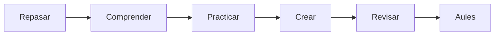

# UD01 · Introducción al uso del ordenador

3 semanas · 6 sesiones aproximadas

## Pregunta guía

¿Cómo podemos aplicar introducción al uso del ordenador para crear un producto útil, seguro y comprobable?

## Producto

**Entorno digital organizado**

[Explicaciones](aprende.md){ .md-button .md-button--primary }
[Actividades](actividades.md){ .md-button }
[Proyecto](proyecto.md){ .md-button }
[Entrega en Aules](entrega.md){ .md-button }

## Ruta

