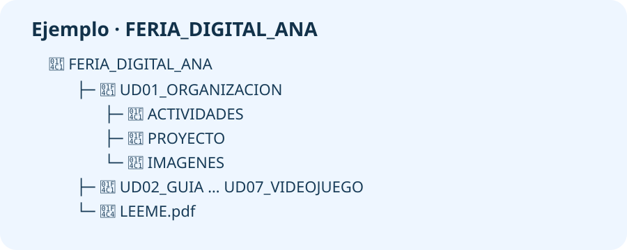

# PROY_UN1 · Preparamos nuestro espacio de trabajo

## El proyecto del curso

Durante el curso prepararemos materiales para una **Feria Digital Responsable**. En cada unidad crearás una parte. En esta primera etapa vas a ordenar el espacio donde guardarás todo el proyecto.

## ¿Qué tienes que hacer?

Crea una carpeta principal llamada `FERIA_DIGITAL_TUNOMBRE`. Dentro debe haber una carpeta para cada unidad y un documento que explique la organización. Otra persona debe poder encontrar un archivo sin preguntarte.

!!! example "Ejemplo terminado"
    Dentro de `FERIA_DIGITAL_ANA` aparecen `UD01_ORGANIZACION`, `UD02_GUIA`, `UD03_PRESUPUESTO`, `UD04_PRESENTACION`, `UD05_IA`, `UD06_DECALOGO` y `UD07_VIDEOJUEGO`. También aparece `LEEME.pdf`.

## Pasos

1. Abre el **Gestor de archivos** de LliureX.
2. En `Documentos`, crea `FERIA_DIGITAL_TUNOMBRE`.
3. Crea dentro las siete carpetas indicadas en el ejemplo.
4. En `UD01_ORGANIZACION`, crea `ACTIVIDADES`, `PROYECTO` e `IMAGENES`.
5. Abre **LibreOffice Writer** y escribe el título `Organización de mi Feria Digital`.
6. Escribe una frase que explique qué se guardará en cada carpeta.
7. Guarda el documento como `LEEME.odt` y expórtalo como `LEEME.pdf`.
8. Haz una captura con el árbol de carpetas abierto.
9. Comprueba que el PDF se abre y que no falta ninguna carpeta.

## Entrega en Aules

Comprime la carpeta completa y entrega `PROY_UN1_ApellidoNombre.zip`. Debe contener las carpetas, `LEEME.odt`, `LEEME.pdf` y la captura `carpetas.png`.

## Puntuación (10 puntos)

| Se comprobará | Puntos |
|---|---:|
| Están todas las carpetas y tienen nombres correctos | 3 |
| El documento explica la organización | 3 |
| Incluye ODT, PDF y captura | 2 |
| El ZIP abre y tiene el nombre pedido | 2 |

!!! tip "Esto se reutiliza"
    No borres esta carpeta. En cada unidad guardarás dentro el nuevo trabajo de la Feria Digital.
