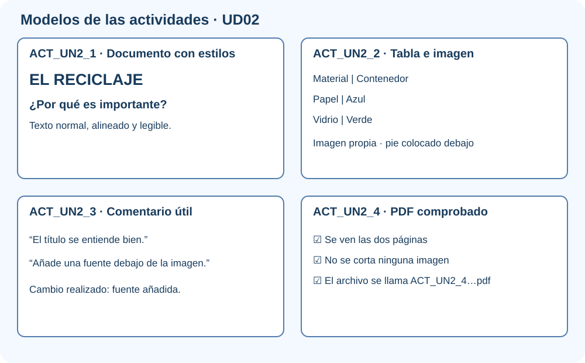

# Actividades · Procesador de textos en la nube

Estas actividades te enseñan, paso a paso, las herramientas que utilizarás para crear la guía de la **Feria Digital Responsable**.

Estas instrucciones están preparadas para quienes utilizan la herramienta por primera vez. Lee **un paso cada vez** y márcalo cuando lo termines.

| Código en Aules | Actividad |
|---|---|
| ACT_UN2_1 | Aplicar estilos a un documento desordenado |
| ACT_UN2_2 | Crear una tabla y una imagen acreditada |
| ACT_UN2_3 | Revisión por parejas con comentarios |
| ACT_UN2_4 | Exportar, comprobar y entregar un PDF |

## ACT_UN2_1 · Aplicar estilos a un documento desordenado

### ¿Qué vas a hacer?

Vas a ordenar un documento para que sea fácil de leer.

!!! example "Ejemplo de resultado"
    Un título con estilo **Título**, dos apartados con **Título 1** y el texto normal sin tamaños puestos manualmente.

### Pasos

1. Abre el documento que te dé el profesor.
2. Selecciona el título y aplica el estilo Título.
3. Aplica Encabezado 1 a cada apartado.
4. Convierte los elementos repetidos en una lista.
5. Revisa que todos los apartados tienen el mismo aspecto.
6. Guarda el resultado como `ACT_UN2_1_ApellidoNombre_v01`.
7. Entra en Aules, abre **ACT_UN2_1**, adjunta el archivo o enlace y pulsa **Enviar tarea**.

### ¿Qué debes entregar?

- El archivo o enlace creado.
- Una captura o frase que demuestre que lo has comprobado.
- Si utilizaste IA, indica para qué y cómo revisaste el resultado.

### Antes de enviar

- [ ] El nombre empieza por `ACT_UN2_1`.
- [ ] El archivo se abre o el enlace funciona.
- [ ] He realizado todos los pasos.
- [ ] Puedo explicar lo que he hecho.
- [ ] No aparecen datos personales.

## ACT_UN2_2 · Crear una tabla y una imagen acreditada

### ¿Qué vas a hacer?

Vas a utilizar tablas e imágenes de forma clara y legal.

!!! example "Ejemplo de resultado"
    Tabla `Herramienta | Uso` con tres filas y una imagen con el pie `Fuente: autor - sitio web - enlace`.

### Pasos

1. Crea la tabla con los encabezados indicados.
2. Completa todas las celdas.
3. Busca una imagen que se pueda reutilizar.
4. Inserta la imagen sin deformarla.
5. Escribe debajo autor, página y enlace.
6. Comprueba que la imagen ayuda a entender el contenido.
7. Guarda el resultado como `ACT_UN2_2_ApellidoNombre_v01`.
8. Entra en Aules, abre **ACT_UN2_2**, adjunta el archivo o enlace y pulsa **Enviar tarea**.

### ¿Qué debes entregar?

- El archivo o enlace creado.
- Una captura o frase que demuestre que lo has comprobado.
- Si utilizaste IA, indica para qué y cómo revisaste el resultado.

### Antes de enviar

- [ ] El nombre empieza por `ACT_UN2_2`.
- [ ] El archivo se abre o el enlace funciona.
- [ ] He realizado todos los pasos.
- [ ] Puedo explicar lo que he hecho.
- [ ] No aparecen datos personales.

## ACT_UN2_3 · Revisión por parejas con comentarios

### ¿Qué vas a hacer?

Vas a mejorar un trabajo mediante comentarios sencillos.

!!! example "Ejemplo de resultado"
    Comentario útil: «El título se entiende. La imagen es pequeña. Auméntala y añade su fuente».

### Pasos

1. Comparte el archivo con permiso de comentario.
2. Lee el trabajo completo de tu compañero.
3. Añade un comentario sobre algo conseguido.
4. Añade otro con una mejora concreta.
5. Lee los comentarios que recibas.
6. Aplica una mejora y marca el comentario como resuelto.
7. Guarda el resultado como `ACT_UN2_3_ApellidoNombre_v01`.
8. Entra en Aules, abre **ACT_UN2_3**, adjunta el archivo o enlace y pulsa **Enviar tarea**.

### ¿Qué debes entregar?

- El archivo o enlace creado.
- Una captura o frase que demuestre que lo has comprobado.
- Si utilizaste IA, indica para qué y cómo revisaste el resultado.

### Antes de enviar

- [ ] El nombre empieza por `ACT_UN2_3`.
- [ ] El archivo se abre o el enlace funciona.
- [ ] He realizado todos los pasos.
- [ ] Puedo explicar lo que he hecho.
- [ ] No aparecen datos personales.

## ACT_UN2_4 · Exportar, comprobar y entregar un PDF

### ¿Qué vas a hacer?

Vas a crear una copia final que se vea igual en cualquier equipo.

!!! example "Ejemplo de resultado"
    Un PDF que abre correctamente, mantiene imágenes y tabla completas y muestra el nombre de la actividad en la primera página.

### Pasos

1. Termina el documento editable.
2. Pulsa Descargar o Exportar como PDF.
3. Guárdalo con el nombre indicado.
4. Abre el PDF.
5. Revisa títulos, imágenes y última página.
6. Si falta algo, corrige el original y exporta otra vez.
7. Guarda el resultado como `ACT_UN2_4_ApellidoNombre_v01`.
8. Entra en Aules, abre **ACT_UN2_4**, adjunta el archivo o enlace y pulsa **Enviar tarea**.

### ¿Qué debes entregar?

- El archivo o enlace creado.
- Una captura o frase que demuestre que lo has comprobado.
- Si utilizaste IA, indica para qué y cómo revisaste el resultado.

### Antes de enviar

- [ ] El nombre empieza por `ACT_UN2_4`.
- [ ] El archivo se abre o el enlace funciona.
- [ ] He realizado todos los pasos.
- [ ] Puedo explicar lo que he hecho.
- [ ] No aparecen datos personales.

!!! info "Mecanografía"
    Una vez por semana se dedicarán entre cinco y diez minutos a mecanografía en forma de juego. Solo se entrega si el profesor lo indica.
