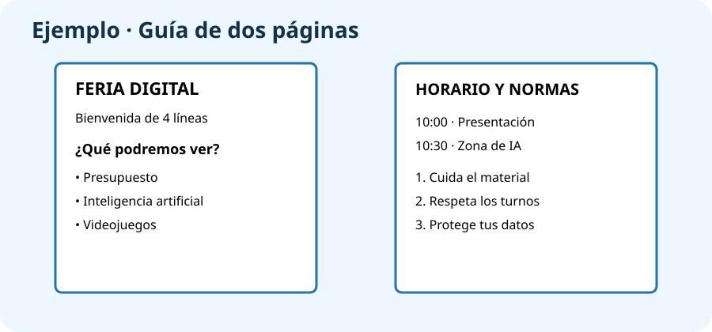

# PROY_UN2 · Guía de la Feria Digital

## Continuamos el proyecto

En la unidad anterior organizaste las carpetas. Ahora crearás el primer material de la **Feria Digital Responsable**: una guía de dos páginas para sus visitantes.

## ¿Qué tienes que hacer?

Con **LibreOffice Writer**, crea una guía que explique qué es la feria, qué encontrarán los visitantes y tres normas para participar correctamente.

!!! example "Ejemplo de contenido"
    **Página 1:** `Bienvenidos a la Feria Digital`, una explicación de cuatro líneas y tres espacios: presupuesto, inteligencia artificial y videojuegos. **Página 2:** horario inventado, tres normas y una imagen con su fuente.

## Pasos

1. Abre la carpeta `FERIA_DIGITAL_TUNOMBRE/UD02_GUIA`.
2. Abre **LibreOffice Writer** y escribe `Guía de la Feria Digital Responsable`.
3. Añade una bienvenida de cuatro o cinco líneas.
4. Crea el apartado `¿Qué podremos ver?` y explica brevemente tres espacios de la feria.
5. Crea una tabla con tres filas para un horario inventado.
6. Añade tres normas sencillas para los visitantes.
7. Inserta una imagen propia o reutilizable y escribe debajo su procedencia.
8. Usa títulos, listas, márgenes y letra fácil de leer.
9. Revisa la ortografía y exporta el documento como PDF de dos páginas.

## Entrega en Aules

- `PROY_UN2_ApellidoNombre.odt`
- `PROY_UN2_ApellidoNombre.pdf`

Guarda también ambos archivos dentro de `UD02_GUIA`.

## Puntuación (10 puntos)

| Se comprobará | Puntos |
|---|---:|
| Explica la feria y sus tres espacios | 3 |
| Incluye horario, normas, imagen y fuente | 3 |
| Está bien organizado y se lee con facilidad | 2 |
| Entrega ODT y PDF de dos páginas | 2 |

!!! tip "Lo usarás después"
    Los espacios que presentes aquí aparecerán de nuevo en el presupuesto y en la presentación de las siguientes unidades.
