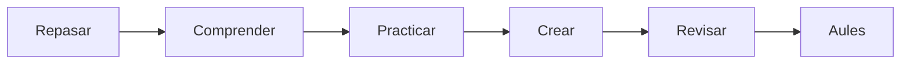

# UD03 · Hojas de cálculo

5 semanas · 10 sesiones aproximadas

## Pregunta guía

¿Cómo podemos aplicar hojas de cálculo para crear un producto útil, seguro y comprobable?

## Producto

**Presupuesto y panel de datos**

[Explicaciones](aprende.md){ .md-button .md-button--primary }
[Actividades](actividades.md){ .md-button }
[Proyecto](proyecto.md){ .md-button }
[Entrega en Aules](entrega.md){ .md-button }

## Ruta

