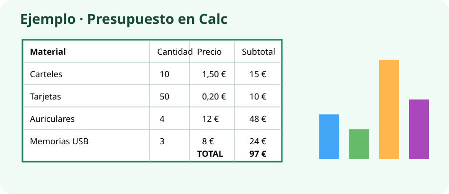

# PROY_UN3 · Presupuesto de la Feria Digital

## Continuamos el proyecto

Ya tienes una guía que explica la feria. Ahora calcularás con **LibreOffice Calc** cuánto costaría preparar sus materiales.

## ¿Qué tienes que hacer?

Crea una hoja con estos datos y utiliza fórmulas para obtener los subtotales y el total.

| Material | Cantidad | Precio por unidad |
|---|---:|---:|
| Carteles | 10 | 1,50 € |
| Tarjetas para visitantes | 50 | 0,20 € |
| Auriculares | 4 | 12 € |
| Memorias USB | 3 | 8 € |

!!! example "Resultados para comprobar"
    Los subtotales deben ser **15 €**, **10 €**, **48 €** y **24 €**. El total debe ser **97 €**.

## Pasos

1. Abre `UD03_PRESUPUESTO` y después **LibreOffice Calc**.
2. Escribe los encabezados `Material`, `Cantidad`, `Precio unidad` y `Subtotal`.
3. Copia los cuatro materiales y sus datos.
4. En el primer subtotal escribe `=B2*C2` y copia la fórmula hacia abajo.
5. Debajo escribe `TOTAL` y la fórmula `=SUMA(D2:D5)`.
6. Aplica formato de moneda y da un formato claro a la tabla.
7. Crea un gráfico de columnas con materiales y subtotales. Titúlalo `Gastos de la Feria Digital`.
8. Cambia un precio y comprueba que el total cambia automáticamente. Después recupera el precio original.
9. Exporta una página PDF en la que se vean tabla y gráfico.

## Entrega en Aules

- `PROY_UN3_ApellidoNombre.ods`
- `PROY_UN3_ApellidoNombre.pdf`

Guárdalos también en `UD03_PRESUPUESTO`.

## Puntuación (10 puntos)

| Se comprobará | Puntos |
|---|---:|
| Datos y subtotales correctos | 3 |
| Total calculado mediante fórmula | 3 |
| Gráfico correcto y con título | 2 |
| Presentación clara y entrega ODS + PDF | 2 |

!!! tip "Lo usarás después"
    En la próxima unidad incluirás el total de 97 € y el gráfico en la presentación de la feria.
