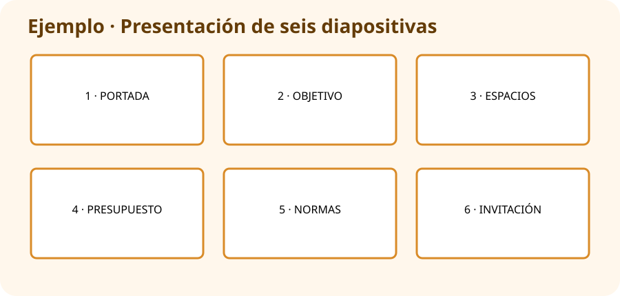

# PROY_UN4 · Presentamos la Feria Digital

## Continuamos el proyecto

Ya has creado la guía y el presupuesto. Ahora vas a reunir esa información en una presentación de **seis diapositivas** y explicarla durante unos tres minutos.

## Las seis diapositivas

1. Portada: `Feria Digital Responsable`, nombre y curso.
2. Objetivo: qué aprenderán los visitantes.
3. Espacios: los tres que explicaste en la guía de la UD02.
4. Presupuesto: total de **97 €** y gráfico de la UD03.
5. Normas: tres normas de participación.
6. Cierre: invitación y fuentes utilizadas.

!!! example "Ejemplo de diapositiva 4"
    Título `Un presupuesto posible`, gráfico grande en el centro y frase `Podemos preparar los materiales básicos por 97 €`. No copies toda la hoja de cálculo.

## Pasos

1. Abre `UD04_PRESENTACION` y **LibreOffice Impress**.
2. Crea las seis diapositivas siguiendo el guion.
3. Recupera información de la guía de la UD02 y el gráfico de la UD03.
4. Usa una frase corta y una imagen principal en cada diapositiva.
5. Mantén los mismos colores y tipos de letra.
6. Añade las fuentes en la última diapositiva.
7. Pulsa `F5` y revisa que todo se vea correctamente.
8. Ensaya con cronómetro: entre 2:30 y 3:30 minutos.

## Entrega en Aules

- `PROY_UN4_ApellidoNombre.odp`
- `PROY_UN4_ApellidoNombre.pdf`

Guárdalos también en `UD04_PRESENTACION`.

## Puntuación (10 puntos)

| Se comprobará | Puntos |
|---|---:|
| Contiene las seis diapositivas pedidas | 3 |
| Reutiliza correctamente guía, presupuesto y gráfico | 2 |
| Texto breve, imágenes útiles y diseño coherente | 2 |
| Exposición clara, fuentes y tiempo correcto | 3 |

!!! tip "Un proyecto que crece"
    No empiezas desde cero: estás mejorando y presentando materiales de las unidades anteriores.
