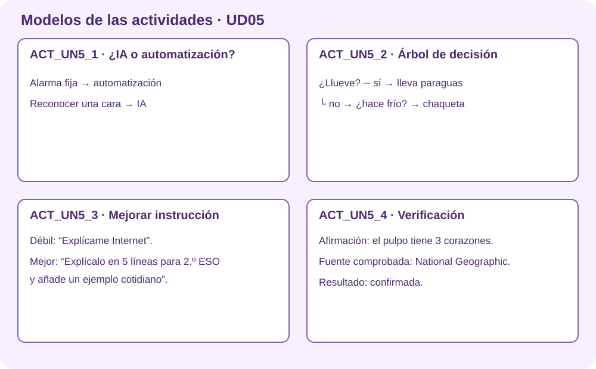

# Actividades · Fundamentos de inteligencia artificial

Estas actividades preparan el rincón `¿Esto es IA?` de la **Feria Digital Responsable**.

Estas instrucciones están preparadas para quienes utilizan la herramienta por primera vez. Lee **un paso cada vez** y márcalo cuando lo termines.

| Código en Aules | Actividad |
|---|---|
| ACT_UN5_1 | Distinguir IA de automatización mediante casos |
| ACT_UN5_2 | Construir un árbol de decisión sencillo |
| ACT_UN5_3 | Comparar resultados al mejorar una instrucción |
| ACT_UN5_4 | Verificar tres afirmaciones generadas por IA |

## ACT_UN5_1 · Distinguir IA de automatización mediante casos

### ¿Qué vas a hacer?

Vas a usar la IA de manera responsable y comprobar sus resultados.

!!! example "Ejemplo de resultado"
    `Calculadora: automatización`; `recomendador de vídeos: IA`; cada respuesta incluye una razón.

### Pasos

1. Lee el caso completo.
2. Señala qué debe decidir una persona.
3. Escribe una instrucción con objetivo, contexto y formato.
4. No introduzcas nombres ni datos personales.
5. Comprueba una afirmación en una fuente externa.
6. Anota qué herramienta usaste, qué cambiaste y cómo lo comprobaste.
7. Guarda el resultado como `ACT_UN5_1_ApellidoNombre_v01`.
8. Entra en Aules, abre **ACT_UN5_1**, adjunta el archivo o enlace y pulsa **Enviar tarea**.

### ¿Qué debes entregar?

- El archivo o enlace creado.
- Una captura o frase que demuestre que lo has comprobado.
- Si utilizaste IA, indica para qué y cómo revisaste el resultado.

### Antes de enviar

- [ ] El nombre empieza por `ACT_UN5_1`.
- [ ] El archivo se abre o el enlace funciona.
- [ ] He realizado todos los pasos.
- [ ] Puedo explicar lo que he hecho.
- [ ] No aparecen datos personales.

## ACT_UN5_2 · Construir un árbol de decisión sencillo

### ¿Qué vas a hacer?

Vas a aprender a guardar cada archivo en su lugar.

!!! example "Ejemplo de resultado"
    Árbol: `¿llueve?` → sí: paraguas; no → `¿hace frío?` → sí: chaqueta; no: salir sin abrigo.

### Pasos

1. Abre tu carpeta personal.
2. Crea una carpeta llamada Informatica.
3. Dentro crea la carpeta de la unidad.
4. Crea dentro Actividades, Recursos y Entregas.
5. Haz una captura donde se vea el árbol completo.
6. Guarda el resultado como `ACT_UN5_2_ApellidoNombre_v01`.
7. Entra en Aules, abre **ACT_UN5_2**, adjunta el archivo o enlace y pulsa **Enviar tarea**.

### ¿Qué debes entregar?

- El archivo o enlace creado.
- Una captura o frase que demuestre que lo has comprobado.
- Si utilizaste IA, indica para qué y cómo revisaste el resultado.

### Antes de enviar

- [ ] El nombre empieza por `ACT_UN5_2`.
- [ ] El archivo se abre o el enlace funciona.
- [ ] He realizado todos los pasos.
- [ ] Puedo explicar lo que he hecho.
- [ ] No aparecen datos personales.

## ACT_UN5_3 · Comparar resultados al mejorar una instrucción

### ¿Qué vas a hacer?

Vas a usar la IA de manera responsable y comprobar sus resultados.

!!! example "Ejemplo de resultado"
    Petición 1: `Explícame Internet`. Petición 2: añade edad, 80 palabras, ejemplo y tres ideas clave; después se comparan.

### Pasos

1. Lee el caso completo.
2. Señala qué debe decidir una persona.
3. Escribe una instrucción con objetivo, contexto y formato.
4. No introduzcas nombres ni datos personales.
5. Comprueba una afirmación en una fuente externa.
6. Anota qué herramienta usaste, qué cambiaste y cómo lo comprobaste.
7. Guarda el resultado como `ACT_UN5_3_ApellidoNombre_v01`.
8. Entra en Aules, abre **ACT_UN5_3**, adjunta el archivo o enlace y pulsa **Enviar tarea**.

### ¿Qué debes entregar?

- El archivo o enlace creado.
- Una captura o frase que demuestre que lo has comprobado.
- Si utilizaste IA, indica para qué y cómo revisaste el resultado.

### Antes de enviar

- [ ] El nombre empieza por `ACT_UN5_3`.
- [ ] El archivo se abre o el enlace funciona.
- [ ] He realizado todos los pasos.
- [ ] Puedo explicar lo que he hecho.
- [ ] No aparecen datos personales.

## ACT_UN5_4 · Verificar tres afirmaciones generadas por IA

### ¿Qué vas a hacer?

Vas a usar la IA de manera responsable y comprobar sus resultados.

!!! example "Ejemplo de resultado"
    Tabla `Afirmación | fuente consultada | confirmada / no confirmada | corrección` con tres filas.

### Pasos

1. Lee el caso completo.
2. Señala qué debe decidir una persona.
3. Escribe una instrucción con objetivo, contexto y formato.
4. No introduzcas nombres ni datos personales.
5. Comprueba una afirmación en una fuente externa.
6. Anota qué herramienta usaste, qué cambiaste y cómo lo comprobaste.
7. Guarda el resultado como `ACT_UN5_4_ApellidoNombre_v01`.
8. Entra en Aules, abre **ACT_UN5_4**, adjunta el archivo o enlace y pulsa **Enviar tarea**.

### ¿Qué debes entregar?

- El archivo o enlace creado.
- Una captura o frase que demuestre que lo has comprobado.
- Si utilizaste IA, indica para qué y cómo revisaste el resultado.

### Antes de enviar

- [ ] El nombre empieza por `ACT_UN5_4`.
- [ ] El archivo se abre o el enlace funciona.
- [ ] He realizado todos los pasos.
- [ ] Puedo explicar lo que he hecho.
- [ ] No aparecen datos personales.

!!! info "Mecanografía"
    Una vez por semana se dedicarán entre cinco y diez minutos a mecanografía en forma de juego. Solo se entrega si el profesor lo indica.
