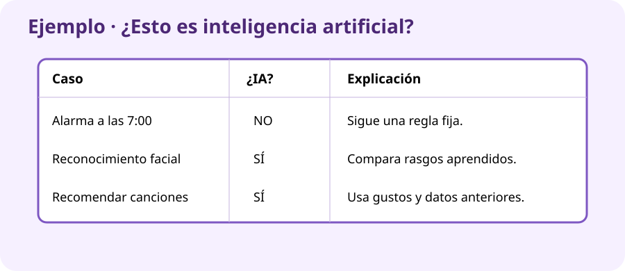

# PROY_UN5 · El rincón «¿Esto es IA?»

## Continuamos el proyecto

La Feria Digital tendrá un rincón para explicar la inteligencia artificial. Vas a crear una ficha con **seis ejemplos cotidianos** para que los visitantes intenten descubrir cuáles usan IA.

## Casos

1. Alarma programada a las 7:00.
2. Desbloqueo del móvil mediante la cara.
3. Calculadora que realiza `25 × 8`.
4. Aplicación que recomienda canciones.
5. Puerta que se abre al pulsar un botón.
6. Filtro que detecta correo basura.

!!! example "Ejemplo completo"
    **Alarma a las 7:00 → No es IA.** Sigue una hora programada y no aprende. Entrada: hora actual. Proceso: compararla con las 7:00. Resultado: sonar.

## Pasos

1. Abre `UD05_IA` y LibreOffice Writer.
2. Escribe el título `¿Esto es inteligencia artificial?`.
3. Explica qué es la IA en tres líneas y con palabras sencillas.
4. Crea una tabla con `Caso`, `¿IA?`, `Por qué`, `Entrada` y `Resultado`.
5. Completa los seis casos. Puedes escribir `Sí`, `No` o `Depende`, pero debes justificarlo.
6. Dibuja con formas y flechas el recorrido `entrada → proceso → resultado` de un caso que use IA.
7. Añade tres preguntas breves para los visitantes y sus soluciones al final.
8. Guarda y exporta como PDF.

## Entrega en Aules

- `PROY_UN5_ApellidoNombre.odt`
- `PROY_UN5_ApellidoNombre.pdf`

Guárdalos también en `UD05_IA`.

## Puntuación (10 puntos)

| Se comprobará | Puntos |
|---|---:|
| Clasifica razonablemente los seis casos | 3 |
| Justifica las respuestas con claridad | 3 |
| Explica entrada, proceso y resultado | 2 |
| Incluye preguntas y entrega ODT + PDF | 2 |

!!! tip "Lo usarás después"
    En la siguiente unidad añadirás normas para que este rincón de IA sea también seguro y responsable.
