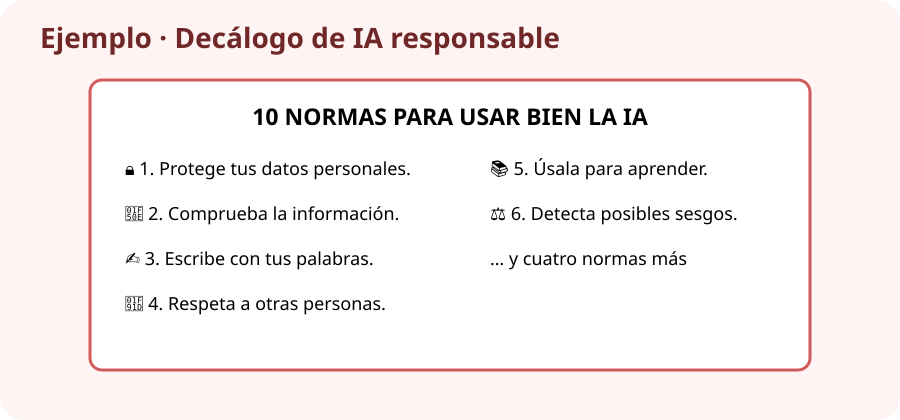

# PROY_UN6 · Decálogo de IA responsable

## Continuamos el proyecto

En la unidad anterior preparaste el rincón sobre IA. Ahora crearás el cartel de normas que se colocará junto a él durante la Feria Digital.

## ¿Qué tienes que hacer?

Crea un **decálogo visual de una página** con diez normas para utilizar la IA de forma segura, ética y útil.

!!! example "Ejemplo de tres normas"
    **1. Protege tus datos.** No escribas dirección, teléfono, contraseñas ni información privada.  
    **2. Comprueba antes de creer.** Contrasta los datos importantes en una fuente fiable.  
    **3. Di cómo la has usado.** Si la IA te ayudó, indícalo en el trabajo.

## Pasos

1. Abre `UD06_DECALOGO` y Writer, Impress o la herramienta autorizada por el profesor.
2. Escribe `10 normas para usar la IA de forma responsable`.
3. Redacta diez normas numeradas, cada una con título y explicación de una o dos líneas.
4. Debes incluir privacidad, verificación, autoría, respeto, sesgos y uso para aprender.
5. Añade tres iconos o imágenes que ayuden a entender las normas.
6. Usa letra grande, contraste y espacio suficiente. Todo debe caber en una página.
7. Pide a un compañero que explique tres normas. Si no las entiende, simplifícalas.
8. Revisa y exporta como PDF.

## Entrega en Aules

- archivo editable (`.odt` o `.odp`);
- `PROY_UN6_ApellidoNombre.pdf`.

Guárdalos también en `UD06_DECALOGO`.

## Puntuación (10 puntos)

| Se comprobará | Puntos |
|---|---:|
| Diez normas concretas y correctas | 4 |
| Incluye los seis temas obligatorios | 2 |
| Diseño claro, legible y con apoyos visuales | 2 |
| Archivo revisado y bien entregado | 2 |

!!! warning "La IA no hace el trabajo por ti"
    Puede darte ideas, pero tú debes seleccionar, comprobar y redactar las normas con tus propias palabras.
