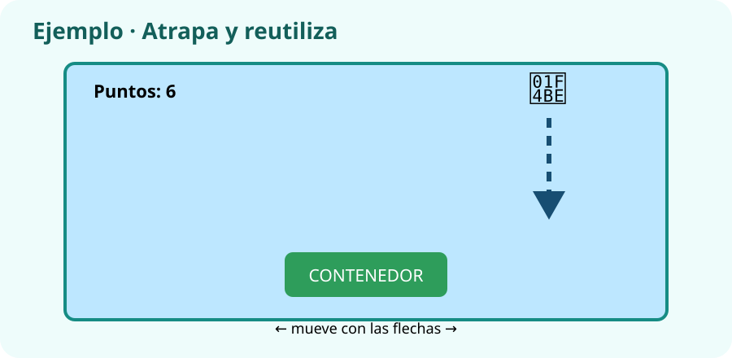

# Actividades · Programación por bloques con Scratch

Estas actividades construyen por partes el videojuego que presentarás al final de la **Feria Digital Responsable**.

Estas instrucciones están preparadas para quienes utilizan la herramienta por primera vez. Lee **un paso cada vez** y márcalo cuando lo termines.

| Código en Aules | Actividad |
|---|---|
| ACT_UN7_1 | Animación controlada por eventos |
| ACT_UN7_2 | Minijuego con puntuación y condición de final |
| ACT_UN7_3 | Depurar un proyecto con errores preparados |
| ACT_UN7_4 | Diseñar pantalla inicial, instrucciones y créditos |

## ACT_UN7_1 · Animación controlada por eventos

### ¿Qué vas a hacer?

Vas a crear un programa por bloques pequeño y comprobable.

!!! example "Ejemplo de resultado"
    Al pulsar la bandera aparece el personaje; con flecha derecha avanza y cambia de disfraz.

### Pasos

1. Abre Scratch y crea un proyecto nuevo.
2. Elige un personaje y un fondo sencillos.
3. Añade el evento de inicio.
4. Programa una acción pequeña y pruébala.
5. Añade la variable o condición solicitada.
6. Prueba el inicio, la acción principal y el reinicio.
7. Guarda el enlace o el archivo.
8. Guarda el resultado como `ACT_UN7_1_ApellidoNombre_v01`.
9. Entra en Aules, abre **ACT_UN7_1**, adjunta el archivo o enlace y pulsa **Enviar tarea**.

### ¿Qué debes entregar?

- El archivo o enlace creado.
- Una captura o frase que demuestre que lo has comprobado.
- Si utilizaste IA, indica para qué y cómo revisaste el resultado.

### Antes de enviar

- [ ] El nombre empieza por `ACT_UN7_1`.
- [ ] El archivo se abre o el enlace funciona.
- [ ] He realizado todos los pasos.
- [ ] Puedo explicar lo que he hecho.
- [ ] No aparecen datos personales.

## ACT_UN7_2 · Minijuego con puntuación y condición de final

### ¿Qué vas a hacer?

Vas a crear un programa por bloques pequeño y comprobable.

!!! example "Ejemplo de resultado"
    El jugador recoge cinco estrellas, suma un punto por cada una y aparece `Has ganado` al llegar a 5.

### Pasos

1. Abre Scratch y crea un proyecto nuevo.
2. Elige un personaje y un fondo sencillos.
3. Añade el evento de inicio.
4. Programa una acción pequeña y pruébala.
5. Añade la variable o condición solicitada.
6. Prueba el inicio, la acción principal y el reinicio.
7. Guarda el enlace o el archivo.
8. Guarda el resultado como `ACT_UN7_2_ApellidoNombre_v01`.
9. Entra en Aules, abre **ACT_UN7_2**, adjunta el archivo o enlace y pulsa **Enviar tarea**.

### ¿Qué debes entregar?

- El archivo o enlace creado.
- Una captura o frase que demuestre que lo has comprobado.
- Si utilizaste IA, indica para qué y cómo revisaste el resultado.

### Antes de enviar

- [ ] El nombre empieza por `ACT_UN7_2`.
- [ ] El archivo se abre o el enlace funciona.
- [ ] He realizado todos los pasos.
- [ ] Puedo explicar lo que he hecho.
- [ ] No aparecen datos personales.

## ACT_UN7_3 · Depurar un proyecto con errores preparados

### ¿Qué vas a hacer?

Vas a encontrar fallos antes de entregar.

!!! example "Ejemplo de resultado"
    Tabla: `esperaba sumar 1 | sumó 2 | había dos bloques cambiar puntos | eliminé uno | ahora suma 1`.

### Pasos

1. Abre tu proyecto de ACT_UN7_2 y crea una copia para corregirla sin perder el original.
2. Revisa nombres, datos, fórmulas o versiones.
3. Marca cada error que encuentres.
4. Escribe por qué es un error.
5. Corrige una copia, no el original.
6. Guarda una lista de los cambios.
7. Guarda el resultado como `ACT_UN7_3_ApellidoNombre_v01`.
8. Entra en Aules, abre **ACT_UN7_3**, adjunta el archivo o enlace y pulsa **Enviar tarea**.

### ¿Qué debes entregar?

- El archivo o enlace creado.
- Una captura o frase que demuestre que lo has comprobado.
- Si utilizaste IA, indica para qué y cómo revisaste el resultado.

### Antes de enviar

- [ ] El nombre empieza por `ACT_UN7_3`.
- [ ] El archivo se abre o el enlace funciona.
- [ ] He realizado todos los pasos.
- [ ] Puedo explicar lo que he hecho.
- [ ] No aparecen datos personales.

## ACT_UN7_4 · Diseñar pantalla inicial, instrucciones y créditos

### ¿Qué vas a hacer?

Vas a crear un programa por bloques pequeño y comprobable.

!!! example "Ejemplo de resultado"
    Pantalla inicial con título y botón; instrucciones con controles; pantalla final con autoría y recursos usados.

### Pasos

1. Abre Scratch y crea un proyecto nuevo.
2. Elige un personaje y un fondo sencillos.
3. Añade el evento de inicio.
4. Programa una acción pequeña y pruébala.
5. Añade la variable o condición solicitada.
6. Prueba el inicio, la acción principal y el reinicio.
7. Guarda el enlace o el archivo.
8. Guarda el resultado como `ACT_UN7_4_ApellidoNombre_v01`.
9. Entra en Aules, abre **ACT_UN7_4**, adjunta el archivo o enlace y pulsa **Enviar tarea**.

### ¿Qué debes entregar?

- El archivo o enlace creado.
- Una captura o frase que demuestre que lo has comprobado.
- Si utilizaste IA, indica para qué y cómo revisaste el resultado.

### Antes de enviar

- [ ] El nombre empieza por `ACT_UN7_4`.
- [ ] El archivo se abre o el enlace funciona.
- [ ] He realizado todos los pasos.
- [ ] Puedo explicar lo que he hecho.
- [ ] No aparecen datos personales.

!!! info "Mecanografía"
    Una vez por semana se dedicarán entre cinco y diez minutos a mecanografía en forma de juego. Solo se entrega si el profesor lo indica.
