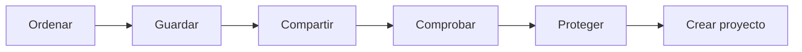

# UD1 · Construye tu entorno digital

## El reto

Durante esta unidad prepararás un espacio digital ordenado para trabajar todo el curso. Aprenderás a guardar, encontrar, compartir y proteger tus archivos, y terminarás creando una **guía visual de supervivencia digital**.

## Qué aprenderás

- Diferenciar archivo, carpeta, programa y ruta.
- Crear una estructura de carpetas fácil de entender.
- Poner nombres útiles y reconocer extensiones.
- Distinguir almacenamiento local y nube.
- Compartir con permisos adecuados.
- Buscar información y comprobar si es fiable.
- Cuidar la privacidad, la huella digital y la convivencia.

## Secuencia de trabajo

| Trabajo | Puntuación |
|---|---:|
| 6 actividades breves | 60 % |
| Proyecto final de unidad | 40 % |

!!! info "Duración orientativa"
    Entre 8 y 10 sesiones. Algunas actividades se harán individualmente y otras por parejas.

